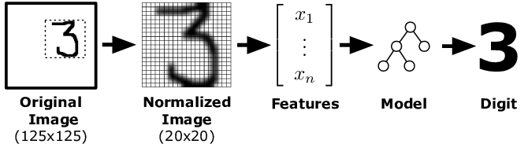

<!-- This is the markdown template for the final project of the Building AI course, 
created by Reaktor Innovations and University of Helsinki. 
Copy the template, paste it to your GitHub README and edit! -->

# AI-Powered Handwritten Digit Recognizer

Final project for the Building AI course

## Summary

Create a simple AI model that recognizes handwritten digits (0-9) using a Convolutional Neural Network (CNN) and the MNIST dataset. The project will include a small web interface where users can draw a digit, and the AI will predict the number. 


## Background

This project solves the problem of digit recognition from handwritten inputs, which is a real-world challenge in multiple industries. Some common applications include:

* Digitizing handwritten documents (e.g., forms, bank checks).
* Automated data entry (reducing human error in manually entering numbers).
* Assistive technology (helping visually impaired users interact with technology).


## How is it used?


### How to Use the Solution?
* User Opens the Web App – A simple interface appears with a canvas where the user can draw a digit.
* User Draws a Number (0-9) – They use a mouse, stylus, or touch input to write a digit on the canvas.
* AI Processes the Input –
  * The image is preprocessed (resized, converted to grayscale, normalized).
  * The trained CNN model predicts the digit.
* Prediction is Displayed – The system shows:
  * The predicted digit (e.g., "You wrote: 7").
  * Confidence score (e.g., "I'm 92% sure").
* User Can Try Again – They can clear the canvas and test with different digits.

 ### When & Where is This Solution Needed?
* Educational Environments – Schools, coding workshops, AI learning.
* Banks & Financial Institutions – Digitizing handwritten numbers on checks.




This is a code example in Python:
```
import tensorflow as tf
from tensorflow import keras
import numpy as np

# Load MNIST dataset
mnist = keras.datasets.mnist
(x_train, y_train), (x_test, y_test) = mnist.load_data()

# Normalize data (scale pixel values to 0-1)
x_train, x_test = x_train / 255.0, x_test / 255.0

# Reshape to add a channel dimension
x_train = x_train.reshape(-1, 28, 28, 1)
x_test = x_test.reshape(-1, 28, 28, 1)

# Define the CNN model
model = keras.Sequential([
    keras.layers.Conv2D(32, (3,3), activation='relu', input_shape=(28,28,1)),
    keras.layers.MaxPooling2D(2,2),
    keras.layers.Conv2D(64, (3,3), activation='relu'),
    keras.layers.MaxPooling2D(2,2),
    keras.layers.Flatten(),
    keras.layers.Dense(128, activation='relu'),
    keras.layers.Dense(10, activation='softmax')  # Output layer (10 digits)
])

# Compile the model
model.compile(optimizer='adam',
              loss='sparse_categorical_crossentropy',
              metrics=['accuracy'])

# Train the model
model.fit(x_train, y_train, epochs=5, validation_data=(x_test, y_test))

# Save the model
model.save("digit_recognizer.h5")

print("Model training complete. Model saved as 'digit_recognizer.h5'.")

```


## Data sources and AI methods


## Challenges

* Speed & Real-Time Processing
* Handling Multiple Languages & Symbols

## What next?

How could your project grow and become something even more? What kind of skills, what kind of assistance would you  need to move on? 


## Acknowledgments

* ResearchGate
: [ResearchGate](https://www.google.com/url?sa=i&url=https%3A%2F%2Fwww.researchgate.net%2Ffigure%2FOur-Digits-task-requires-recognition-of-handwritten-digits-Participants-collect-data_fig4_221518120&psig=AOvVaw2NjbG5jLO2hDsUaGO-5wxt&ust=1739798583180000&source=images&cd=vfe&opi=89978449&ved=0CBcQjhxqFwoTCJisx_ekyIsDFQAAAAAdAAAAABAJ)

